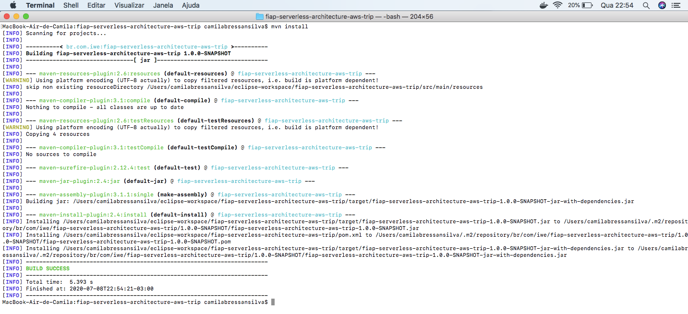
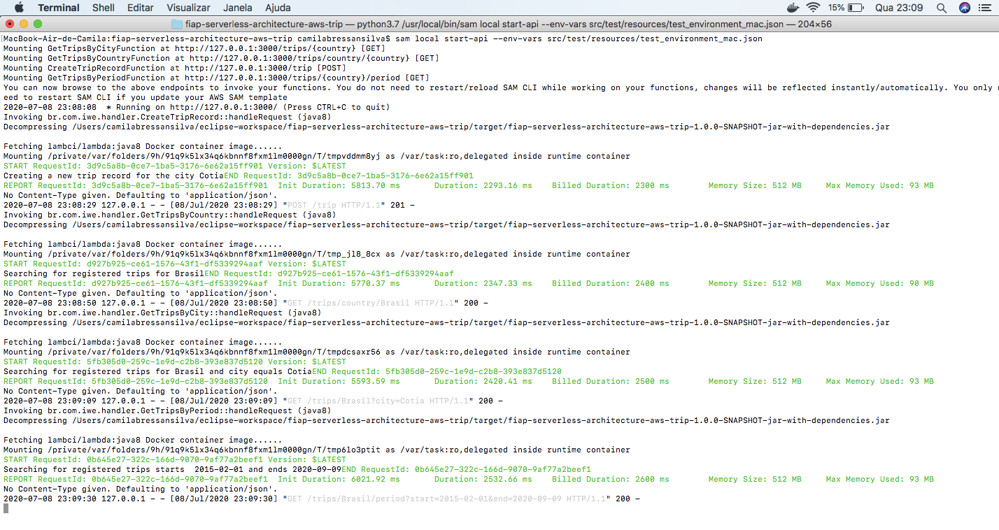
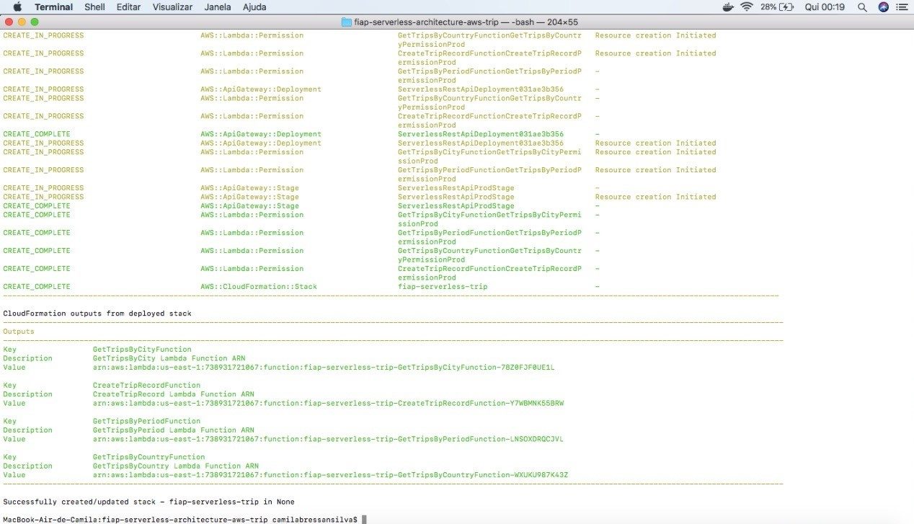
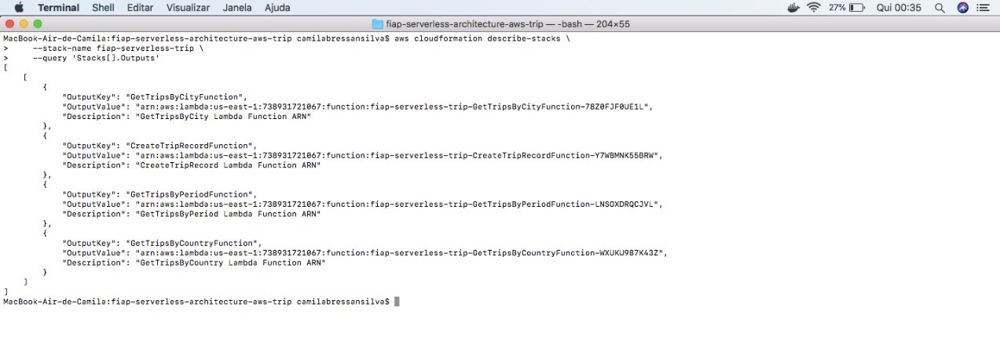
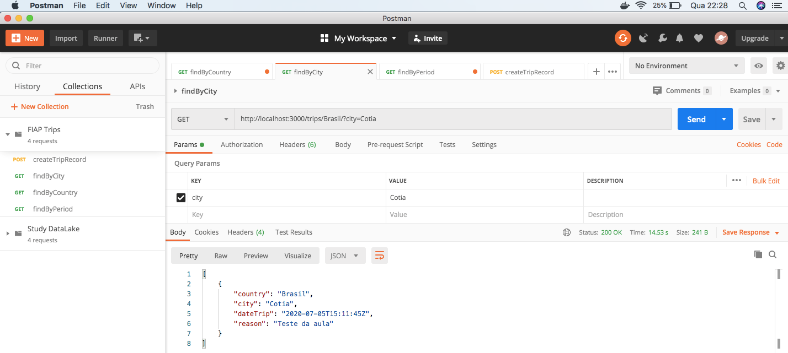
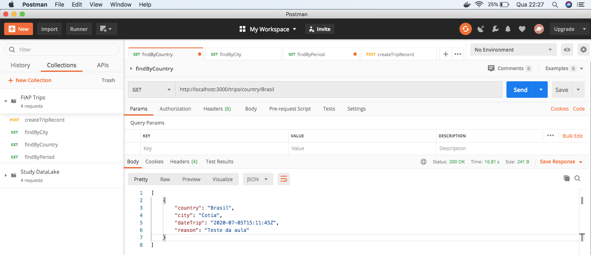
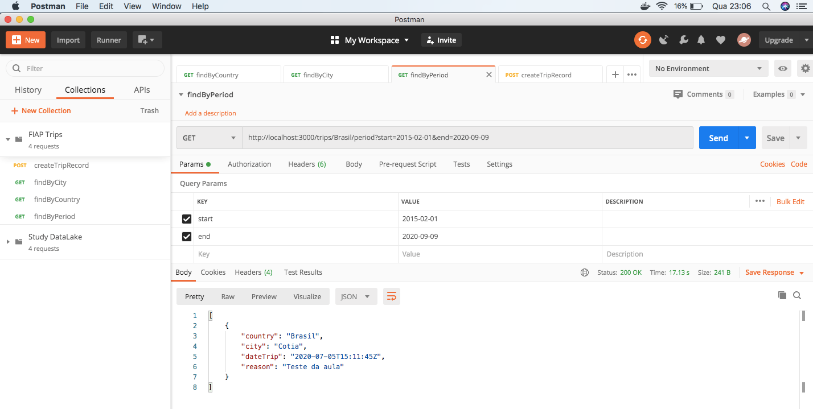
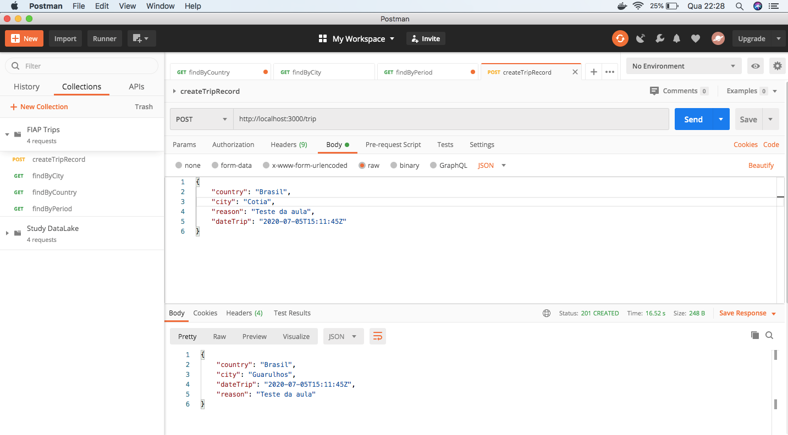

## AWS SAM Application - Projeto Trips - FIAP

Essa aplicação demonstrará o uso de AWS SAM, Amazon API Gateway, AWS Lambda e Amazon DynamoDB..


## Pré-requisitos para execução da aplicação

* AWS CLI já configurado
* [Java SE Development Kit 8 installed](http://www.oracle.com/technetwork/java/javase/downloads/jdk8-downloads-2133151.html)
* [Docker installed](https://www.docker.com/community-edition)
* [Maven](https://maven.apache.org/install.html)
* [SAM CLI](https://github.com/awslabs/aws-sam-cli)
* [Python 3](https://docs.python.org/3/)

## Processo de setup

### Instalando dependências

Usaremos `maven` para instalar nossas dependências e colocar nossa aplicação dentro de um JAR.

```bash
mvn clean install -X -U
```

Após o término da instalação das dependencias, aguarde gerar a versão compilada da aplicação :




### Desenvolvimento Local

**Chamando nossa função localmente através do API Gateway**
**observação:** Se for rodar o comando abaixo a partir do linux, é importante validar se a pasta local do projeto tem permissão de acesso ao seu usuário. 
Caso precise dar permissão o comando linux é:

```bash 
sudo chown -R <seu_usuario> local/ 
```

1. Iniciar o DynamoDB Local em um Docker container. `docker run -p 8000:8000 -v $(pwd)/local/dynamodb:/data/ amazon/dynamodb-local -jar DynamoDBLocal.jar -sharedDb -dbPath /data`


2. Criar a tabela DynamoDB. `aws dynamodb create-table --table-name trip --attribute-definitions AttributeName=country,AttributeType=S AttributeName=dateTrip,AttributeType=S AttributeName=city,AttributeType=S AttributeName=reason,AttributeType=S --key-schema AttributeName=country,KeyType=HASH AttributeName=dateTrip,KeyType=RANGE --local-secondary-indexes 'IndexName=cityIndex,KeySchema=[{AttributeName=country,KeyType=HASH},{AttributeName=city,KeyType=RANGE}],Projection={ProjectionType=ALL}' 'IndexName=reasonIndex,KeySchema=[{AttributeName=country,KeyType=HASH},{AttributeName=reason,KeyType=RANGE}],Projection={ProjectionType=ALL}' --billing-mode PAY_PER_REQUEST --endpoint-url http://localhost:8000`

Se a tabela já existir, você pode excluir através do comando: `aws dynamodb delete-table --table-name trip --endpoint-url http://localhost:8000`


3. Iniciar o SAM local API.
 - No Mac: `sam local start-api --env-vars src/test/resources/test_environment_mac.json`
 - No Windows: `sam local start-api --env-vars src/test/resources/test_environment_windows.json`
 - No Linux: `sam local start-api --env-vars src/test/resources/test_environment_linux.json`
 
 
 
OBS: Se você já possui o contêiner localmente (no seu caso, o java8), pode usar --skip-pull-image para remover o download

Se o comando anterior foi executado com êxito, agora você deve conseguir realizar a chamada: `http://localhost:3000/trips/Brasil`.
Ele deve retornar 404. Agora você pode explorar todos os endpoints, usando o arquivo `src/test/resources/FIAP Trips.postman_collection.json` para importar uma API Rest Collection para o Postman.

** SAM CLI ** é usado para emular o Lambda e o API Gateway localmente e usa nosso `template.yaml` para entender como inicializar esse ambiente (tempo de execução, onde está o código fonte etc.)


## Empacotamento e implantação

O tempo de execução do AWS Lambda Java aceita um arquivo zip ou um arquivo JAR independente - usamos o último neste exemplo. O SAM usará a CodeUripropriedade para saber onde procurar aplicativos e dependências:

Em primeiro lugar, precisamos de um local S3 bucketonde possamos fazer upload de nossas funções Lambda empacotadas como ZIP antes de implantarmos qualquer coisa - se você não tiver um bucket S3 para armazenar artefatos de código, é um bom momento para criar um:

```
export BUCKET_NAME=fiap-serverless-trip
aws s3 mb s3://$BUCKET_NAME
```

Em seguida, execute o seguinte comando para empacotar nossa função Lambda para S3:

```
sam package \
    --template-file template.yaml \
    --output-template-file packaged.yaml \
    --s3-bucket $BUCKET_NAME

```

Em seguida, o comando a seguir criará uma Cloudformation Stack e implantará seus recursos SAM.

```
sam deploy \
    --template-file packaged.yaml \
    --stack-name fiap-serverless-trip \
    --capabilities CAPABILITY_IAM

```




Após a conclusão da implantação, você pode executar o seguinte comando para recuperar a URL do Terminal API Gateway:

```
aws cloudformation describe-stacks \
    --stack-name fiap-serverless-trip \
    --query 'Stacks[].Outputs'

```

O comando acima resultará na listagem dos endpoints da aplicação :




----

## Demonstração das funcionalidades Postman

- Recuperação de viagens por cidade:




- Recuperação de viagens por país:




- Recuperação de viagens por período:




- Criação de novo registro de viagem:


